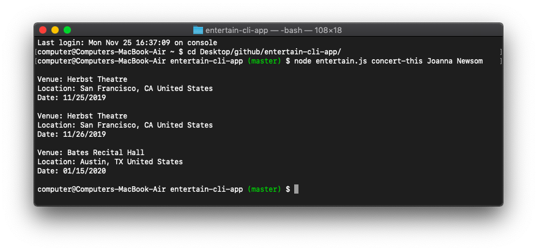

entertain.js is a command line Node.js app. Enter your favorite musician's name or band and see upcoming concert events. Enter a song title and find out which album it's from. Enter a movie title to view the film's IMDB and RT rating.  
This, and so much more!

This app uses three API's. Each API requires authentication via API Key or Client ID/Client Secret.  
I will list the three API's below:  
* [Bandsintown API](https://app.swaggerhub.com/apis-docs/Bandsintown/PublicAPI/3.0.0)  
* [Spotify API](https://developer.spotify.com/)  
* [OMDb API](http://www.omdbapi.com/)

How do I find out if my favorite musician has any upcoming shows?  
`node entertain.js concert-this <musician/band name here>`

How do I learn more about a song?  
`node entertain.js spotify-this-song <song title here>`

How do I learn more about a movie?  
`node entertain.js spotify-this-song <movie title here>`